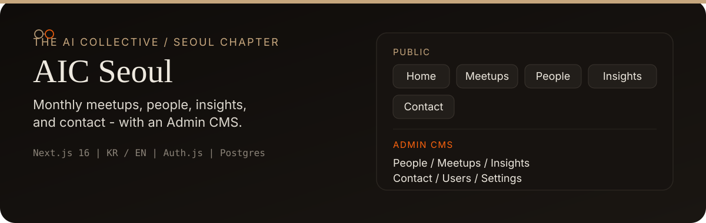
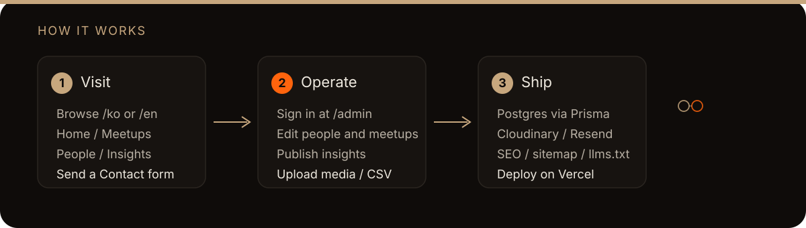
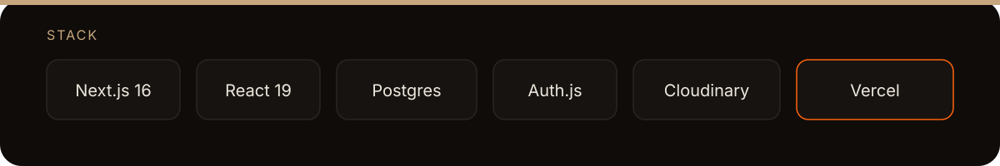

<p align="center">
  
</p>

# AIC Seoul Website

[The AI Collective](https://www.aicollective.com/) 서울 챕터 공식 웹사이트입니다.  
월간 오프라인 모임, 원데이 클래스, 운영진 소개, 인사이트, 문의 창구와 운영진용 Admin CMS를 한곳에서 제공합니다.

| | |
|---|---|
| 저장소 | [saewookkangboy/aicseoul_site](https://github.com/saewookkangboy/aicseoul_site) |
| 기획 | 이중대 대표, 이정임 대표 |
| 개발 | 박충효 ([chunghyo@troe.kr](mailto:chunghyo@troe.kr)) |

---

## 무엇이 준비되어 있나

### 퍼블릭 (`/ko`, `/en`)
- **Home** — 히어로, Why/What, People·Partner 티저, CTA(+ LinkedIn)
- **Meetups** — 월간 모임, 원데이 클래스, 아카이브 사진벽
- **People** — 운영진 그리드, LinkedIn/웹사이트 선택 노출
- **Insights** — Featured + 목록, TipTap HTML, 썸네일
- **Contact** — 문의 폼 → DB, honeypot, rate limit

### Admin (`/admin`)
- Credentials 가입·로그인, 초대 코드, SuperAdmin 권한
- People · Meetups · Insights · Contact · Settings · Users CRUD
- Cloudinary 미디어, CSV, TipTap 에디터

<p align="center">
  
</p>

---

## 어떻게 다른가

- **운영진이 직접 편집** — 코드 배포 없이 모임·멤버·인사이트·문의를 CMS로 관리
- **KR / EN** — locale 라우팅 + Gemini 번역 캐시(키 없으면 원문 폴백)
- **출시 준비 보안** — rate limit, CSP, 업로드 검증, 프로덕션 signup fail-closed
- **SEO / GEO** — canonical·OG·JSON-LD·sitemap·robots·`llms.txt`

<p align="center">
  
</p>

| 영역 | 선택 |
|---|---|
| 앱 | Next.js 16 (App Router) · React 19 · TypeScript · Tailwind CSS v4 |
| 데이터 | PostgreSQL · Prisma 6 · Railway Postgres(호스팅 DB) · Auth.js |
| Auth | Auth.js (NextAuth v5) Credentials + bcrypt |
| 미디어 / 메일 | Cloudinary · Resend |
| 배포 | Vercel · Web Analytics |

---

## 빠른 시작

**요구 사항:** Node 20+ · pnpm 9+ · Docker(로컬 Postgres) 또는 원격 `DATABASE_URL` / `DIRECT_URL`

```bash
pnpm install
cp .env.example .env   # AUTH_SECRET, SUPERADMIN_* 등 로컬 값으로 교체
pnpm db:up
pnpm exec prisma migrate dev --name init   # 최초 마이그레이션
pnpm db:seed
pnpm dev
```

| 항목 | URL / 값 |
|---|---|
| 사이트 | http://localhost:3000 |
| Admin | http://localhost:3000/admin/login |
| SuperAdmin | `.env`의 `SUPERADMIN_EMAILS` + `SUPERADMIN_SEED_PASSWORD` |
| SEO / GEO | `/sitemap.xml` · `/robots.txt` · `/llms.txt` |

기타: `pnpm db:migrate` · `pnpm db:studio` · `pnpm db:seed:prod` · `pnpm build` · `pnpm test`

---

## 환경 변수

로컬: [`.env.example`](./.env.example) · 배포: [`.env.vercel.example`](./.env.vercel.example) · 상세: [`docs/gates/P5-vercel-setup.md`](./docs/gates/P5-vercel-setup.md)

**시크릿·프로젝트 ref·실계정 키는 README/커밋에 넣지 마세요.**

| 변수 | 용도 |
|---|---|
| `DATABASE_URL` | Prisma 런타임 (로컬 5433 / 프로덕션 Railway 공개 URL) |
| `DIRECT_URL` | 마이그레이션용 — 프로덕션에서는 `DATABASE_URL`과 동일 |
| `AUTH_SECRET` / `AUTH_URL` | Auth.js |
| `NEXT_PUBLIC_SITE_URL` | canonical / OG 절대 URL |
| `SUPERADMIN_EMAILS` | SuperAdmin (최대 3) |
| `SUPERADMIN_SEED_PASSWORD` | 시드용 임시 비밀번호 |
| `ADMIN_SIGNUP_INVITE_CODE` | Admin 가입 초대 코드 |
| `CLOUDINARY_*` | 원격 업로드 |
| `RESEND_API_KEY` / `RESEND_FROM` / `NOTIFY_EMAILS` | 문의 알림 |
| `GEMINI_API_KEY` / `GEMINI_TRANSLATE_MODEL` | CMS 자동 번역 |

---

## 디렉터리

```
src/
  app/[locale]/(public)/  # Home, Meetups, People, Insights, Contact
  app/admin/              # Auth + Console CMS
  app/api/                # Auth, 업로드 API
  components/             # 퍼블릭 · Admin UI
  lib/                    # auth, db, i18n, security, seo, media
prisma/                   # schema, migrations, seed
supabase/                 # CLI · remote schema
docs/gates/               # P0~P5 게이트
docs/superpowers/         # 스펙 · 플랜
assets/readme/            # README 비주얼
```

---

## 진행 상태

| Phase | 내용 | 상태 |
|---|---|---|
| P0–P4 | 착수 → 퍼블릭 → Admin → Cloudinary/Resend/SEO | ✅ 구현·검수 승인 |
| **P5** | MVP 출시 (Vercel · Tier A · Cloudinary · Resend) | 🔄 운영자 Track 대기 |

**다음 (G6)**
1. 운영자 런북 — [`P5-tier-a-cloudinary-resend-runbook.md`](./docs/gates/P5-tier-a-cloudinary-resend-runbook.md)
2. 「Tier A 준비 완료」 → Production 배포 · 시드 · 스모크 → G6b 검수
3. 도메인 확정 시 DNS + `AUTH_URL` · Resend 도메인 인증

의도적 보류: Hero 장문 CMS, Insights 카테고리 필터 UI, 멤버 게시판, 결제/티켓팅.

---

## 문서

- [`PRD.md`](./PRD.md) — 제품 요구사항
- [`docs/PROCESS.md`](./docs/PROCESS.md) — 개발 프로세스
- [`docs/gates/`](./docs/gates/) — P0~P5 게이트
- [`docs/gates/P5-vercel-setup.md`](./docs/gates/P5-vercel-setup.md) — Vercel env·빌드
- [`docs/gates/P5-railway-postgres-cutover.md`](./docs/gates/P5-railway-postgres-cutover.md) — Supabase→Railway dump/restore
- [`docs/gates/P5-tier-a-checklist.md`](./docs/gates/P5-tier-a-checklist.md) — Tier A 체크리스트
- [`docs/gates/P5-security-ops-checklist.md`](./docs/gates/P5-security-ops-checklist.md) — 보안 운영
- [`docs/superpowers/`](./docs/superpowers/) — Superpowers × Gates
- [`reports/`](./reports/) — 퍼포먼스 감사
- `AIC_Seoul_웹사이트_목업_최종_이정임.html` — 기획 목업 원본

## License

See [`LICENSE`](./LICENSE).
